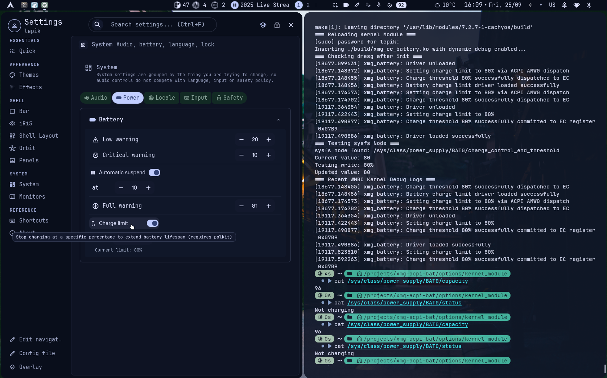

# XMG EVO 15 (E25) Battery Charge Control

Linux battery charge threshold management for the **XMG EVO 15 (E25)** and compatible TongFang AMD Strix Point platforms (AMI BIOS). 

Prolong your XMG laptop's lithium battery life by keeping it's capacity level between 20% and 80%(similar to what apple macbooks do).

This project provides a native Linux kernel module that interfaces directly with the Embedded Controller (EC) register `0x07B9` via the ACPI WMI pipeline (`\_SB.AMW0.WMBC`). By registering standard power supply attributes, it natively unlocks battery threshold controls in desktop environments like KDE Plasma, GNOME, and Niri/Waybar setups.

---

## How it looks (niri/iNiR)
git push -u origin main

*(niri/iNir: Setting->System->Power->Battery->Charge limit was disabled (greyed out), so I've dug in and now it works like a charm.)*

---

## Hardware & Technical Details

- **Target Platform:** TongFang AMD Strix Point (XMG EVO 15 E25)
- **EC Offset:** `0x07B9` (Integer range `1`–`100`)
- **ACPI Pipeline:** Routed via `\_SB.AMW0.WMBC`
  - 3-Step EC Register Sequence: Unlock/Initialize (`0x0001`), Write Payload (`0x00[Val_Hex]07B9`), and Commit/Sync.

---

## Repository Structure

```shell
	xmg-acpi-bat/
	├── docs/
	│   └── charge_limit_niri_ui.png
	├── kernel_module/
	│   ├── Makefile
	│   ├── install.sh
	│   └── xmg_ec_battery.c
	├── systemd_service/
	│   ├── install.sh
	│   ├── xmg-battery-limit.service
	│   └── xmg-set-charge-limit
	└── README.md
```

# Installation & Usage

## Option 1: Native Kernel Module (Recommended)

### 1. Prerequisites
Ensure you have your kernel headers and a build toolchain installed:
- Arch Linux: `sudo pacman -S linux-headers base-devel clang llvm`
- Ubuntu/Debian: `sudo apt install build-essential linux-headers-$(uname -r)`

### 2. Build and Install the Kernel Module
Navigate into the `kernel_module/` directory and run the helper script to compile and insert the module dynamically:
```shell
	cd kernel_module
	./install.sh
```

### 3. Verify sysfs Node

Once loaded, check your power supply attribute and its limit setting:

```shell
	cat /sys/class/power_supply/BAT0/charge_control_end_threshold
	echo 80 | sudo tee /sys/class/power_supply/BAT0/charge_control_end_threshold
```

### 4. Make It Permanent on Boot
To ensure the kernel module loads automatically on every system boot, register the module name in `/etc/modules-load.d/xmg-battery.conf`:
```shell
	echo "xmg_ec_battery" | sudo tee /etc/modules-load.d/xmg-battery.conf
```

## Option 2: Systemd Service Fallback (Userland `acpi_call`)

If you prefer not to compile a kernel module and want to use userland `acpi_call` instead:

### 1. Install and Load `acpi_call`
- **Arch Linux:**
```shell
	sudo pacman -S acpi_call dkms
	sudo modprobe acpi_call
``` 

- **Ubuntu/Debian:**
```shell
	sudo apt install acpi-call-dkms
	sudo modprobe acpi_call
``` 
 
### 2. Install and Enable the Service
Navigate to the `systemd_service/` directory and run the installer script:

```shell
	cd systemd_service
	./install.sh
```

### 3. Check the service status:
 
```shell
	sudo systemctl status xmg-battery-limit.service
```

### 4. Disable and Remove the Systemd Service
If your desktop environment (like GNOME, KDE, XFCE, Hyprland, Niri,...) natively manages the battery threshold using the kernel module's sysfs node, you can disable and clean up the fallback service:
```shell
sudo systemctl disable --now xmg-battery-limit.service
sudo rm /etc/systemd/system/xmg-battery-limit.service
sudo rm /usr/local/bin/xmg-set-charge-limit
sudo systemctl daemon-reload
```

## Useful References & Acknowledgments
- [EC Hacking Guide by 8051enthusiast](https://8051enthusiast.github.io/2021/07/05/001-EC_legacy.html)
